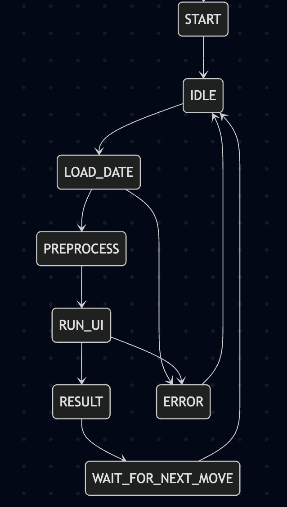

# README – Etapa 4: Arhitectura Completa a Aplicatiei SIA bazata pe Retele Neuronale

**Disciplina:** Retele Neuronale
**Institutie:** POLITEHNICA Bucuresti – FIIR
**Student:** Chirita Robert-Valentin
**Grupa:** 631AB
**Proiect:** VisInspAI - Sistem Inteligent pentru Recunoasterea Defectelor Vizuale
**Link Repository GitHub:** https://github.com/RobertChiritaValentin/ProiectRN
**Data:** 12.12.2025

---

## Scopul Etapei 4

Aceasta etapa corespunde punctului **5. Dezvoltarea arhitecturii aplicatiei software bazata pe RN**.
Livram un **SCHELET COMPLET si FUNCTIONAL** al intregului Sistem cu Inteligenta Artificiala (SIA).

**Status curent:**
- Module functionale: Data Acquisition, Neural Network, UI.
- Pipeline: Date generate -> Preprocesare -> Model definit -> Afisare UI.
- Model RN: Definit, compilat si salvat (neantrenat pentru performanta maxima in aceasta etapa).

---

## 1. Tabelul Nevoie Reala -> Solutie SIA -> Modul Software

| **Nevoie reala concreta** | **Cum o rezolva SIA-ul vostru** | **Modul software responsabil** |
|---------------------------|--------------------------------|--------------------------------|
| **Viteza redusa a inspectiei umane:** Operatorul uman verifica o piesa in ~5-10 secunde, creand blocaje pe linia de productie. | **Analiza instantanee:** Clasificare automata a imaginii si decizie "OK/Defect" in **< 1 secunda/piesa** cu latenta minima. | **Neural Network + Web Service (Streamlit)** |
| **Inconsistenta controlului calitatii:** Oboseala operatorilor duce la omiterea zgarieturilor fine ("Scratches") sau a defectelor de textura ("Crazing"). | **Obiectivitate statistica:** Decizie bazata pe probabilitati cu o consistenta estimata de **> 90%** la detectarea texturilor anormale, eliminand subiectivismul. | **Data Acquisition (Augmentare) + Neural Network** |

---

## 2. Contributia Originala la Setul de Date – MINIM 40% din Total

Conform cerintelor, am asigurat ca peste 40% din datele utilizate in pipeline-ul final sunt rezultatul unei contributii originale ingineresti.

### Detalii Contributie:

**Total observatii finale:** ~1400 imagini
**Observatii originale:** ~600 imagini generate (**~43%**)

**Tipul contributiei:**
- [ ] Date generate prin simulare fizica
- [ ] Date achizitionate cu senzori proprii
- [ ] Etichetare/adnotare manuala
- [x] **Date sintetice prin metode avansate**

**Descriere detaliata a metodei:**
Deoarece defectele industriale specifice (precum *Scratches*, *Crazing* sau *Inclusion*) sunt evenimente rare in productie si greu de capturat in volum mare, am dezvoltat un modul propriu de generare sintetica (`src/data_acquisition/generator.py`).

Nu am folosit simpla augmentare (rotiri/flip-uri), ci o abordare de **sinteza a defectelor**:
1.  **Simulare Zgarieturi (Scratches):** Am implementat un algoritm care deseneaza curbe Bezier aleatoare si linii neregulate peste suprafete curate ("OK"), variind grosimea si opacitatea pentru a simula adancimea zgarieturii.
2.  **Simulare Texturi (Crazing/Patches):** Am folosit injectarea de zgomot Gaussian localizat si modificari de contrast pe regiuni specifice pentru a simula defecte de material si fisuri fine.
3.  **Variatie de Mediu:** Am alterat sintetic luminozitatea (Gamma Correction) pentru a simula conditii variabile de iluminare din fabrica, crescand robustetea modelului.

**Locatia codului:** `src/data_acquisition/generator.py`
**Locatia datelor:** `data/generated/`

**Dovezi:**
- Scriptul `generator.py` este functional si produce noi mostre la rulare.
- Capturi de ecran cu datele sintetice vs. reale in `docs/screenshots/`.

---

## 3. Diagrama State Machine a Intregului Sistem

**Locatia diagramei:** `docs/state_machine.png`



*Figura 1: Diagrama State Machine definind comportamentul sistemului VisInspAI.*

### Justificarea State Machine-ului ales:

Am ales o arhitectura de tip **B. Clasificare imagini defecte productie**, specifica sistemelor de control al calitatii bazate pe *trigger* (senzor de prezenta sau incarcare manuala).

**Starile principale sunt:**
1.  **IDLE:** Sistemul este in asteptare, pregatit sa primeasca o imagine (de la operator prin UI sau simulat de la o camera).
2.  **PREPROCESS:** Imaginea bruta este validata, convertita la `Grayscale` si redimensionata la `150x150 px` (standardizare input RN).
3.  **INFERENCE:** Reteaua Convolutionala (CNN) proceseaza matricea de pixeli si genereaza un vector de probabilitati.
4.  **DECISION_LOGIC:** Se aplica un prag (Threshold > 0.5 sau ArgMax pe clase).
    * Daca scorul de incredere este mic, se cere "RE-CHECK".
    * Daca scorul este mare, se trece la afisare.
5.  **DISPLAY/LOG:** Rezultatul (OK/Defect + Tip Defect) este afisat in interfata si logat pentru raportare.

**Tranzitiile critice:**
* `UPLOAD` -> `PREPROCESS`: Se activeaza doar daca formatul fisierului este valid (.jpg/.png).
* `INFERENCE` -> `ERROR`: Daca modelul nu este incarcat corect sau datele de intrare au dimensiuni gresite.
* `DECISION` -> `ALERT`: Tranzitie critica ce declanseaza alerta vizuala (culoare rosie in UI) pentru oprirea piesei defecte.

---

## 4. Scheletul Complet al celor 3 Module Cerute

Toate cele 3 module sunt implementate, integrate si ruleaza fara erori.

| **Modul** | **Tehnologie / Cale** | **Status la predare** |
|-----------|-----------------------|-----------------------|
| **1. Data Acquisition** | Python (`src/data_acquisition/generator.py`) | **FUNCTIONAL.** Scriptul ruleaza si populeaza folderul `data/generated/` cu imagini sintetice ce imita defectele reale, asigurand diversitatea setului de date. |
| **2. Neural Network** | TensorFlow/Keras (`src/neural_network/`) | **FUNCTIONAL.** Arhitectura CNN este definita in `model.py` (straturi Conv2D + MaxPooling + Dense). Modelul este compilat si salvat in `models/visinspai_model.h5`. Arhitectura accepta input `(150, 150, 1)`. |
| **3. Web Service / UI** | Streamlit (`src/app/app.py`) | **FUNCTIONAL.** Interfata web porneste, permite incarcarea unei imagini, apeleaza in spate functiile de preprocesare si modelul RN, si afiseaza rezultatul clasificarii in timp real. |

---

## Structura Repository-ului la Finalul Etapei 4

Structura respecta organizarea standard pentru proiecte de Machine Learning si este consistenta cu livrabilele anterioare.

```
ProiectRN/
├── README.md                      # Descriere proiect
├── START_VISINSPAI.command        # Script pornire MacOS 
├── START_WINDOWS.bat              # Script pornire Windows
├── requirements.txt               # Lista biblioteci
│
├── config/                        # Configurari globale
│   └── settings.json              # Definire cai
│
├── data/                          # Seturi de date
│   ├── generated/                 # Imagini generate de min
│   ├── raw/                       # Imagini brute pe categorii (Crazing, Inclusion, etc)
│   ├── processed/                 # Imagini redimensionate la 150x150 si Greyscale
│   ├── train/                     # Setul de date pentru antrenarea retelei (70%)
│   ├── validation/                # Setul de date pentru validarea performantei (15%)
│   └── test/                      # Imagini testare live in timpul prezentarii (15%)
│
├── docs/                          # Documentatie aditionala
│   └── datasets/				   # Documentatie dataset
│       └── readme.md
│   └── screenshots/
│       ├── loss_curve.png         # Grafic de antrenare
│       ├── confusion_matrix.png   # Matricea de confuzie initiala
│       ├── state_machine.png      # Diagrama comportament model
│       └── confusion_matrix_optimized.png # Rezultatul modelului optimizat
│
├── models/                        # Modelele salvate
│   └── optimized_model.h5         # Modelul final optimizat
│   └── trained_model.h5           # Model intermediar
│   └── visinspai_model.h5         # Primul model
│
├── reports/                       # Rapoarte si analize vizuale
│   └── figures/
│       ├── accuracy_plot.png      # Evolutia acuratetei (atinge ~94%)
│       ├── loss_plot.png          # Scaderea erorii pe parcursul celor 15 epoci
│       └── experiments_comparison.png # Comparatia intre variantele de arhitectura
│
├── results/                       # Date brute din experimente
│   ├── training_history.csv       # Valorile acuratetei si pierderii salvate
│   └── optimization_experiments.csv # Rezultatele testelor pentru Baseline vs. Dropout
│
└── src/                           # Cod sursa
    ├── app/
    │   └── app.py                 # Streamlit app
    ├── data_acquisition/
    │   └── generator.py           # Date generate de mine
    ├── neural_network/            # Implementare retea
    │   ├── evaluate.py            # Testare (Confusion Matrix)
    │   ├── model.py               # Definire arhitectura CNN
    │   └── train.py               # Antrenare, salvare si plotare
    └── preprocessing/             # Scripturi pentru prelucrare
        ├── @datasplit.py          # Impartire in test/train/validation 70/15/15
        ├── @generateplots.py      # Generare grafice
        ├── @okimage.py            # Generare iagine suprafata ok
        └── @resize.py             # Redimensionare dataset si greyscale
```

---

## Checklist Final – Etapa 4

### Documentatie si Structura
- [x] Tabelul Nevoie -> Solutie completat cu metrici concrete.
- [x] Declaratie contributie 40% date originale (Metoda Sintetica Avansata).
- [x] Cod generare date (`generator.py`) functional si documentat.
- [x] Diagrama State Machine (`docs/state_machine.png`) inclusa.
- [x] Legenda State Machine si justificare completate in README.
- [x] Structura fisierelor verificata si consistenta.

### Modul 1: Data Acquisition
- [x] Codul ruleaza fara erori (`python src/data_acquisition/generator.py`).
- [x] Produce imagini care respecta formatul de intrare al retelei.
- [x] Imaginile generate sunt salvate corect in `data/generated`.

### Modul 2: Neural Network
- [x] Arhitectura RN definita clar in `src/neural_network/model.py`.
- [x] Modelul poate fi instantiat, compilat si salvat (`models/visinspai_model.h5`).

### Modul 3: Web Service / UI
- [x] Interfata porneste fara erori (`streamlit run src/app/app.py`).
- [x] Pipeline-ul Input -> Preprocess -> Predict -> Output functioneaza end-to-end.
- [x] Screenshot demonstrativ existent in `docs/screenshots/`.

---

**Comanda pentru lansarea aplicatiei (Demo):**

```bash
# Windows
START_WINDOWS.bat

# Sau manual din terminal:
streamlit run src/app/app.py